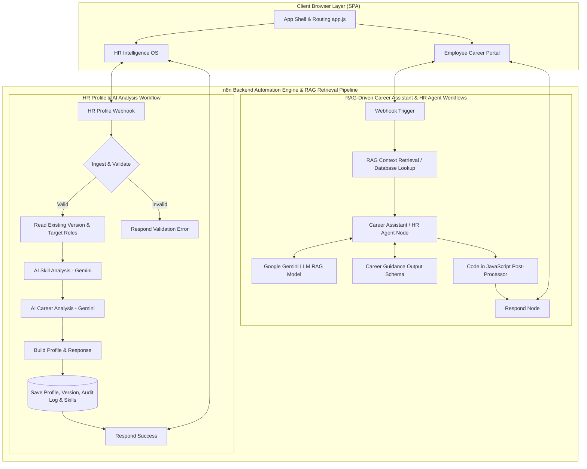

# ⚡ TalentPulse AI Enterprise Platform
### *AI-Powered HR Intelligence OS, Skill Gap Analysis & Career Mobility Platform*

[](https://github.com/praveen2007-VY/Buildathon_finals)
[](https://vitejs.dev/)
[](https://tailwindcss.com/)
[](https://n8n.io/)
[](https://deepmind.google/technologies/gemini/)
[](https://github.com/praveen2007-VY/Buildathon_finals)
[](LICENSE)

---

## 📖 Executive Summary

**TalentPulse AI Enterprise Platform** is a dual-portal HR Intelligence OS and Employee Career Growth ecosystem engineered for enterprise talent strategy, internal workforce mobility, and automated skill gap remediation.

Powered by **Retrieval-Augmented Generation (RAG) Model Architecture**, **n8n Webhook Orchestration**, and **Google Gemini AI Agents**, TalentPulse dynamically retrieves enterprise context (employee histories, verified skills, and role benchmarks) to ground AI models with real-time data for precise career coaching, structured schema parsing, versioned profile building, and audit logging.

---

## 🏗️ End-to-End System Architecture

The platform architecture integrates a lightweight **Vanilla JS (Vite)** frontend with an **n8n AI Workflow Automation Backend** driven by **Google Gemini Chat Models**.



---

## 🔄 n8n Backend Workflow Architecture

The platform relies on three core **n8n workflow pipelines** to orchestrate AI intelligence, profile versioning, and enterprise data persistence.

### 1. Career Assistant Webhook Workflow
Automates real-time, multi-turn AI career coaching for employees.


* **Trigger**: `Career Assistant Webhook` (POST endpoint accepting employee prompt, session ID, and context).
* **Context Hydration**: `Get a row` node retrieves employee history and profile data.
* **AI Engine**: `Career Assistant Agent` node powered by **Google Gemini Chat Model** and memory buffers.
* **Structured Output**: Constrained by `Career Guidance Schema` Output Parser for reliable JSON structure.
* **Response Handling**: Formatted by `Code in JavaScript` post-processing and returned via the `Respond` node.

---

### 2. HR Agent Webhook Workflow
Handles HR-specific intelligence queries, multi-employee matching, and talent strategy recommendations.


* **Trigger**: `Career Assistant Webhook1` POST endpoint.
* **Data Fetching**: `Get a row1` node fetches enterprise workforce competencies and role benchmarks.
* **AI Intelligence**: `HR AGENT` node driven by **Gemini Chat Model1**.
* **Output Standard**: Enforced via `Career Guidance Schema1` and refined with `Code in JavaScript1` before sending back HTTP response `Respond1`.

---

### 3. HR Profile & AI Skill Analysis Pipeline Workflow
Orchestrates deep resume/profile processing, dual Gemini analysis (Skill Analysis + Career Analysis), versioning, and audit logging.


* **Ingestion & Validation**: Receives profile payload at `HR Profile Webhook` and passes through `Ingest & Validate`. Invalid requests immediately return `Respond Validation Error`.
* **Dual-Stage Gemini AI Analysis**:
  1. Reads existing employee version and target job roles (`Read Existing Version` -> `Read Roles`).
  2. **AI Skill Analysis**: Executes Gemini model paired with `Skill Analysis Schema`.
  3. **AI Career Analysis**: Executes Gemini model paired with `Career Analysis Schema`.
* **Persistence & Audit Loop**:
  1. `Build Profile & Response`: Compiles normalized skills, recommendations, and match metrics.
  2. `Save Profile`: Persists updated profile record.
  3. `Save Version`: Stores immutable version snapshot.
  4. `Save Audit Log`: Records compliance audit timestamp.
  5. `Save Skills`: Updates skill repository.
  6. `Respond Success`: Returns completed payload back to TalentPulse.

---

## 🔥 Key Platform Modules & Features

### 👤 1. Employee Career Portal

* **🤖 AI Career Assistant (n8n Webhook Copilot)**:
  * Multi-turn conversational interface powered by `VITE_CAREER_ASSISTANT_WEBHOOK_URL`.
  * Contextual awareness passing employee role, department, ID, and conversation history.
  * 6 Instant-start action cards (*"What skills should I improve?"*, *"Find roles matching my profile"*, *"Create my learning roadmap"*, etc.).
  * Interactive modal overlays for **Fast-Track Learning Plans** and **Career Vector Progression Roadmap**.
  * File attachment preview and voice dictation UI.
* **📄 Resume Skill Extraction Pipeline**:
  * 5-Stage processing pipeline: File Upload ➔ Text Parsing ➔ AI Skill Extractor ➔ Skill Normalization ➔ Profile Auto-Sync.
  * Extracted skills automatically update the employee's verified competency database and proficiency scores.
* **🎯 AI Skill Profile & Competency Matrix**:
  * Visual competency matrix with proficiency sliders (0–100%).
  * Categorized skill tags (Languages, Data Architecture, Cloud/MLOps, Leadership).
* **💼 Internal Opportunity Marketplace**:
  * Job matching algorithm showing internal roles with instant % match scores.
  * Missing skill breakdown and 1-click internal mobility application.
* **📚 Personalized Learning & Growth**:
  * Tailored course recommendations (Enterprise AI Academy, DeepLearning.AI).
  * Progress tracking, hours logged, and completion certificates.

---

### 🏢 2. HR & Leadership Intelligence OS

* **🔬 Multi-Employee AI Skill Gap Analysis**:
  * Select single or multiple employees from the database and evaluate against targeted job requisitions.
  * Calculates match percentage, matched competencies, and missing skill gaps in real time.
* **⚡ Automatic Skill Assignment & Feedback Dispatcher**:
  * Automatically assigns missing skill tags to employee profiles.
  * Generates and dispatches custom development plans and feedback notifications directly to the employee's inbox.
  * Triggers downstream n8n Webhook automation payloads with complete evaluation telemetry.
* **📝 Job Requisition & Role Manager**:
  * Interface to post job openings, set required skill competencies, pay bands ($180k–$220k), and work location policies (Hybrid/Remote).
* **👥 Employee Management Directory**:
  * Central directory with quick search, filtering by department, and new employee onboarding forms.
* **📊 Workforce Analytics & Executive Reports**:
  * Departmental skill distribution, high-potential internal candidates, readiness index, and OKR tracking.

---

## 🛠️ Tech Stack & Technical Specifications

| Component | Technology | Description |
| :--- | :--- | :--- |
| **Frontend Framework** | Vanilla JavaScript (ES6+ Modules) | Lightweight, zero-framework SPA architecture |
| **Build Tooling** | [Vite 5.4](https://vitejs.dev/) | Fast HMR development server and production bundler |
| **CSS & Design System** | Tailwind CSS v3 + Stitch Token Palette | Custom extended Material Design 3 enterprise color tokens |
| **AI RAG Architecture** | [Retrieval-Augmented Generation (RAG)](https://github.com/praveen2007-VY/Buildathon_finals) | Context retrieval pipeline fetching enterprise profile & benchmark data |
| **Workflow Engine** | [n8n](https://n8n.io/) Automation Backend | Serverless Webhook pipelines with data persistence & audit logging |
| **AI LLM Models** | [Google Gemini](https://deepmind.google/technologies/gemini/) | RAG-grounded LLM Chat & Analysis models with structured output parsers |
| **Icons & Typography** | Google Fonts & Material Symbols | Inter, Plus Jakarta Sans & Material Symbols Outlined |
| **Data Engine** | Reactive LocalStorage Store | Persistent browser state with fallback seed data |

---

## 📁 Detailed Project Structure

```
hr-requirement dashboard/
├── index.html                     # Main HTML entry point & Tailwind theme config
├── package.json                   # Project dependencies and npm scripts
├── vite.config.js                 # Vite configuration
├── .env                           # Environment variables (n8n Webhook Endpoint)
├── .env.example                   # Environment template file
├── README.md                      # Comprehensive project documentation
├── docs/
│   └── images/                    # n8n Gemini workflow architecture diagrams
│       ├── n8n-career-assistant-workflow.jpg
│       ├── n8n-hr-agent-workflow.jpg
│       └── n8n-hr-profile-analysis-workflow.jpg
└── src/
    ├── css/
    │   └── style.css              # Custom utility styles, animations & glassmorphism
    ├── services/
    │   └── careerAssistantApi.js  # n8n Webhook API service & robust JSON parser
    └── js/
        ├── app.js                 # Master Router, hash listener & DOM controller
        ├── data.js                # Central state engine, mock database & domain logic
        ├── components/
        │   ├── header.js          # Persistent top navbar & module switcher
        │   ├── sidebar.js         # Dynamic navigation menu (Employee vs HR)
        │   └── modals.js          # Global Search (Ctrl+K) & Quick AI Drawer (Ctrl+J)
        └── views/                 # View controllers for Employee & HR portals
```

---

## 🚀 Quick Start & Installation

### Prerequisites
* **Node.js**: `v18.0.0` or higher
* **npm**: `v9.0.0` or higher

### Steps to Run Locally

1. **Clone the Repository**
   ```bash
   git clone -b main https://github.com/praveen2007-VY/Buildathon_finals.git
   cd Buildathon_finals
   ```

2. **Install Dependencies**
   ```bash
   npm install
   ```

3. **Configure Environment Variables**
   Ensure `.env` contains your active n8n webhook URL:
   ```env
   VITE_CAREER_ASSISTANT_WEBHOOK_URL=https://praveen2007.app.n8n.cloud/webhook-test/career-assistant
   ```

4. **Launch Development Server**
   ```bash
   npm run dev
   ```
   Access the dashboard at `http://localhost:5173/`

5. **Build for Production**
   ```bash
   npm run build
   ```
   To test the production distribution build:
   ```bash
   npm run preview
   ```

---

## ⌨️ Global Keyboard Shortcuts

| Shortcut | Action |
| :--- | :--- |
| `Ctrl + K` / `Cmd + K` | Open Global Search Overlay |
| `Ctrl + J` / `Cmd + J` | Open Quick AI Drawer |
| `Esc` | Close all active modal overlays |

---

## 📄 License

This project is open-source under the **MIT License**.

---

<p align="center">
  <b>Buildathon Finals Submission</b> • TalentPulse AI Team
</p>
